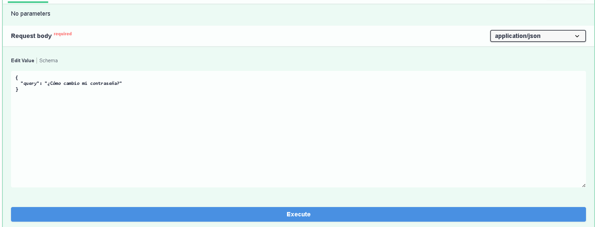
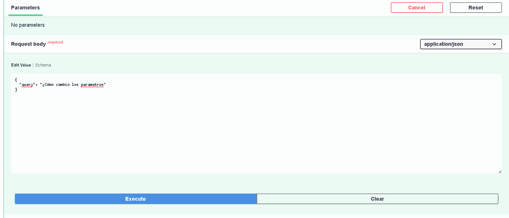
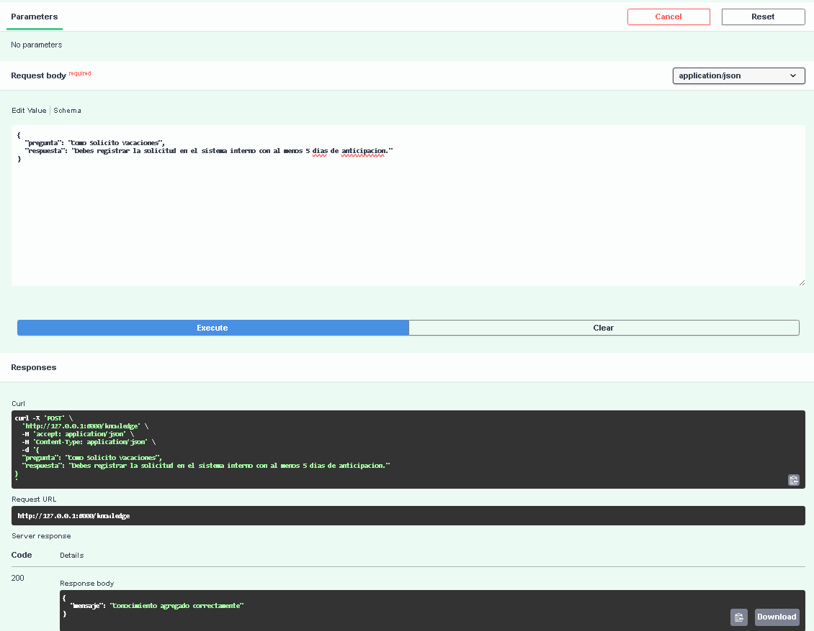

# Cari IA - Sistema de Sugerencias Automaticas

## Resumen

**Cari IA** es una **API REST** desarrollada con **FastApi** que permite a asesores de atencion al cliente recibir **sugerencias automaticas** basadas en una base de preguntas frecuentes mientras responden consultas de usuarios.

El sistema recibe una consulta en lenguaje natural y devuelve una sugerencia relevante, utilizando una logica de similitud de texto simple.
La solucion esta diseñada como una **prueba tecnica funcional**, priorizando claridad, correcta arquitectura y cumplimiento estricto de los requerimientos establecidos.

---

## Contexto del Problema

En los flujos de atencion al cliente, los asesores suelen responder repetidamente a un conjunto reducido de preguntas frecuentes.
Esto genera:

- Repeticion innecesaria de respuestas.
- Posibles inconsistencias en la informacion entregada.
- Aumento del tiempo de atencion por consulta

El objetivo de esta prueba tecnica es construir un sistema ligero que asista al asesor sugiriendo respuestas relevantes en tiempo real, sin introducir complejidad innecesaria ni dependencias externas, y demostrando buenas practicas de desarrollo backend con Python.

## Alcance de la Solucion

### Funcionalidades Incluidas

- API REST desarrollada con **FastApi**.
- Endpoint `POST /suggest` para generar sugerencias a partir de una consulta del usuario.
- Endpoint `GET /history` para consultar el historial de preguntas y respuestas.generadas
- Base de conocimiento predefinida en memoria como estructura de datos en Python.
- Logica basica de similitud de texto para encontrar la pregunta mas cercana.
- Persistencia temporal del historial de consultas en memoria.
- Validaciones simples de entrada usando **Pydantic**.
- Pruebas unitarias basicas para cada endpoint.

## Funcionalidades excluidas

- Persistencia en base de datos
- Autenticacion y autorizacion
- Procesamiento avanzado de lenguaje natural
- Infraestructura productiva (caching, colas, observabilidad)

Estas exclusiones son **decisiones conscientes**, alineadas con el alcance de la prueba tecnica, que busca evaluar el diseño, claridad y correcto funcionamiento de una API REST sin sobre-ingenieria.

---

## Arquitectura General

La aplicacion sigue una arquitectura modular y simple, alineada con el alcance de la prueba tecnica y orientada a facilitar la lectura, el mantenimiento y las pruebas.

La estructura del proyecto se organiza de la siguiente manera:

```text
app/
├── main.py              # Punto de entrada y definición de endpoints
├── modelos.py           # Modelos de datos y validaciones (Pydantic)
├── conocimiento.py      # Base de conocimiento predefinida en memoria
├── servicios.py         # Lógica de negocio (sugerencias y similitud)
├── almacenamiento.py    # Persistencia temporal del historial en memoria
tests/
├── test_sugerencias.py  # Pruebas del endpoint /suggest
├── test_historial.py    # Pruebas del endpoint /history
requirements.txt
README.md

```

---

## Tecnologias Utilizadas

- FastApi
- Pydantic
- Uvicorn
- difflib
- pytest

---

### Principios Aplicados

- **Separacion de responsabilidades**: Cada modulo cumple una funcion clara y acotada.
- **Bajo Acoplamiento**: Los endpoints delegan la logica de negocio a servicios independientes.
- **Simplicidad Intencional**: Se evita complejidad innecesaria que no aporta valor al problema y alcance planteado.

Esta organizacion permite extender o modificar funcionalidades sin afectar el resto del sistema, manteniendo el codigo legible y facil de testear.

---

## Decisiones Tecnicas

## Uso de FastApi

Se utiliza **FastApi** por ser un framework ligero, moderno y ampliamente adoptado en el ecosistema Python para el desarrollo de API REST.

Permite:

- Definir endpoints de forma clara y decalrativa
- Validar datos de entrada mediante **Pydantic**
- Generar documentacion automatica **(OpenAPI)**
- Facilitar la escritura de pruebas.

Esta eleccion cumple directamente con los requerimientos de la prueba tecnica.

---

### Base de Conocimiento en Memoria

La base de preguntas frecuentes se mantiene en memoria, definida directamente en el código como una estructura de datos en Python.

Esta decisión se toma porque:

- La prueba no requiere persistencia permanente.
- Reduce dependencias externas.
- Simplifica la ejecución y el despliegue del proyecto.

---

### Logica de Similitud de Texto

Para la generacion de sugerencias se implementa una busqueda basica de similitud utilizando tecnicas simples como `difflib.get_close_matches`.

Este enfoque:

- Cumple con el requerimiento funcional.
- Es facil de entender y mantener.
- Evita sobre-ingenieria en un contexto de prueba tecnica.

En un entorno productivo, esta logica podria reemplazarse por tecnicas mas avanzadas de procesamiento de lenguaje natural.

---

### Persistencia de Historial

El historial de consultas y sugerencias se almacena en una estructura en memoria.

Esta decision:

- Cumple con el requerimiento de persistencia temporal.
- Evita el uso de bases de datos innecesarias.
- Facilita las pruebas automatizadas.

---

### Validaciones de Entrada

Se utilizan modelos de **Pydantic** para validar las solicitudes entrantes, asegurando que:

- El campo `query` este presente.
- El valor no sea vacio.

Esto permite manejar errores de forma clara y consistente.

---

### Pruebas Automatizadas

Se incluyen pruebas unitarias basicas para cada endpoint utilizando `pytest`.

Las pruebas validan:

- Codigos de estado HTTP.
- Estructura del JSON de respuesta.
- Casos basicos de error.

El objetivo de las pruebas es garantizar el correcto funcionamiento del sistema y demostrar buenas practicas de desarrollo backend.

---

## Instalacion

### Requisitos Previos

- Python 3.10 o superior
- pip

### Pasos de Instalacion

### 1. Clonar el repositorio:

```bash
git clone https://github.com/filosocode/cari-ia-fastapi-sugerencias.git
cd cari-ia-fastapi-sugerencias

```

### 2. Crear y activar un entorno virtual

```bash
python -m venv venv
source venv/bin/activate

# En Windows:
# venv\Scripts\activate
```

### 3. Instalar Dependencias

```bash
pip install -r requirements.txt
```

---

## Ejecucion de la Aplicacion

Ejecutar el siguiente comando desde la raiz del proyecto:

```bash
uvicorn app.main:app --reload
```

La API estara disponible en:

- http://127.0.0.1:8000
- Swagger UI: http://127.0.0.1:8000/docs
- ReDoc: http://127.0.0.1:8000/redoc

---

## Endpoints Disponibles

### POST /suggest

Genera una sugerencia basada en la consulta del usuario.

#### Entrada

```json
{
  "query": "¿Cómo cambio mi contraseña?"
}
```

#### Salida

```json
{
  "suggestion": "Puedes cambiar tu contraseña en la sección de configuración de tu perfil."
}
```

### GET /history

Devuelve el historial completo de consultas procesadas.

### POST /knowledge

Permite agregar nuevas preguntas y respuestas a la base de conocimiento en memoria.

#### Entrada

```json
{
  "pregunta": "¿Cómo contacto soporte?",
  "respuesta": "Puedes escribir a soporte@cari.com"
}
```

## Documentación interactiva (Swagger UI)

La API expone documentacion automatica mediante **Swagger UI**, lo que permite explorar y probar los endpoints de forma interactiva.

la documentacion esta disponible en:
http://127.0.0.1:8000/docs

### Ejemplo: POST /suggest

Permite enviar una consulta y obtener una sugerencia basada en la base de conocimiento.

#### Execute



#### Response


### Pregunta salida de los parametros

#### Execute



#### Response


### Ejemplo: GET /history

Devuelve el historial completo de consultas procesadas durante la ejecucion.


### Ejemplo: POST /knowledge

Permite agregar dinamicamente nuevas preguntas y respuestas a la base de conocimiento en memoria.
El conocimiento agregado puede ser utilizado inmediatamente por el endpoint **/suggest**.

#### Execute



#### Response


#### Response suggest


## Pruebas

Ejecutar:

```bash
pytest
```

Las pruebas validan el comportamiento correcto de los endpoints y las validaciones de entrada.

---

## Limitaciones Conocidas

Este proyecto fue desarrollado como una **prueba tecnica**, por lo que presenta una serie de limitaciones que son **conscientes y aceptadas**, alineadas con el alcance y los objetivos planteados.

- **Persistencia en memoria**
  Toda la informacion (Base de conocimiento e historial de consultas)se almacena en memoria.
  Al reiniciar la aplicacion los datos se pierden.

- **Logica de similitud basica**
  El sistema utiliza una comparacion simple de texto, sin comprension semantica ni contexto.
  Preguntas formuladas de manera muy diferente pueden no generar coincidencias adecuadas.

- **Ausencia de autenticacion y autorizacion**
  No existe control de acceso a los endpoints.
  Cualquier cliente puede consultar el historial o agregar conocimiento.

- **Sin control de concurrencia**
  El manejo de estado en memoria no contempla escenarios con multiples instancias o alta concurrencia.

- **No orientado a produccion**
  La aplicacion no incluye mecanismos de observabilidad, metricas, logging estructurado ni manejo avanzado de errores.

Estas limitaciones no representan errores de diseño, sino **decisiones tecnicas deliberadas** para mantener el sistema simple, claro y enfocado en los requerimientos de la prueba.

## Posibles Mejoras

- Incorporar persistencia permanente de datos mediante una base de datos.
- Implementar similitud semantica para mejorar la calidad de las sugerencias.
- Agregar autenticacion y control de acceso a los endpoints.
- Incluir metricas, logging y observabilidad.
